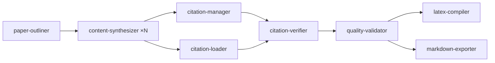

<pre align="center">
██████╗  █████╗ ██████╗ ███████╗██████╗ ███████╗ ██████╗ ██████╗  ██████╗ ███████╗
██╔══██╗██╔══██╗██╔══██╗██╔════╝██╔══██╗██╔════╝██╔═══██╗██╔══██╗██╔════╝ ██╔════╝
██████╔╝███████║██████╔╝█████╗  ██████╔╝█████╗  ██║   ██║██████╔╝██║  ███╗█████╗  
██╔═══╝ ██╔══██║██╔═══╝ ██╔══╝  ██╔══██╗██╔══╝  ██║   ██║██╔══██╗██║   ██║██╔══╝  
██║     ██║  ██║██║     ███████╗██║  ██║██║     ╚██████╔╝██║  ██║╚██████╔╝███████╗
╚═╝     ╚═╝  ╚═╝╚═╝     ╚══════╝╚═╝  ╚═╝╚═╝      ╚═════╝ ╚═╝  ╚═╝ ╚═════╝ ╚══════╝
</pre>

  <em>An agent framework for synthesizing styled, cited, publication-ready documents — on demand.</em>

  
  
  
  

---

Paperforge turns an outline and a pile of source material into a fully
cited academic paper, whitepaper, literature review, or book — styled in
LaTeX or Markdown, with every claim traceable back to a source. It's a
**framework**, not an app: a roster of agent specs, LaTeX/Markdown
templates, and a local citation-tracking subsystem (Citationforge) that an
LLM drives end-to-end.

This is a standalone extraction of that framework layer from a larger
private orchestrator. It does no research and makes no network calls of
its own — you (or the LLM driving it) supply the source material, and
Paperforge handles structure, prose, styling, and citation bookkeeping.

## Use it with Claude

Point Claude (Claude Code, or any MCP-connected client) at this repo with
an MCP server wired up to the agents below, then just ask for the paper:

> "Use Paperforge to write an IEEE-style paper on \<topic\>, ~6000 words,
> with a systematic literature review structure. Cite \<sources I'm
> giving you\> and compile it to PDF."

Claude plans the outline, dispatches section-writing in parallel, builds
the bibliography, verifies every citation against the source text you
gave it, and compiles the final PDF/Markdown — following the phase-by-phase
protocol in [CLAUDE.md](CLAUDE.md).

## Pipeline

One agent per section, dispatched in parallel; citations are tracked and
verified against real source text before anything compiles. Full detail
in [CLAUDE.md](CLAUDE.md).

## Examples

Real output, generated end-to-end by Paperforge from an outline and source
material — nothing hand-edited after compilation.

| Document | Type | Pages | Output path |
|---|---|---|---|
| [**Gödel**](examples/Godel.pdf) — a cited research biography with reflections on the limits of formal systems | Book | 52 | LaTeX → PDF, `book/dark_charcoal_book` |
| [**Against AI Feudalism**](examples/Against_AI_Feudalism.pdf) — how Ed4All is building the missing layer of the AI economy | Whitepaper | 24 | Markdown export, styled to print via an HTML/CSS layer |
| [**Shades of Accessibility**](examples/Shades_of_Accessibility.pdf) — why ADA sunglasses accommodations do not require disability disclosure | Technical whitepaper | 14 | LaTeX → PDF, `academic/preprint` |
| [**Meditations on Self Emergence**](examples/Meditations_on_Self_Emergence.pdf) — Volume I: governance, coherence, and the long game | Book | 180 | LaTeX → PDF, `book/dark_charcoal_book` |
| [**Unified Theory of Science (UToS)**](examples/Unified_Theory_of_Science.pdf) — a cross-scale framework of constraints, control, and governance via theta (θ) | Academic paper | 148 | LaTeX → PDF, `academic/preprint` |

## What's here

- `agents/` — Markdown specs for each pipeline agent (outliner, content synthesizer, citation manager/loader/verifier, LaTeX compiler, book assembler, markdown exporter, quality validator)
- `citationforge/` — SQLite-backed citation store: no network access of any kind — you attach source text you already have, and it stores and matches against it so claims can be verified against actual text, not just metadata
- `scripts/` — LaTeX compiler wrapper, WCAG-compliant HTML converter
- `templates/` — LaTeX templates (academic, whitepaper, lit review, federal proposal, book) and shared components

## What you bring

- An agent dispatcher (MCP server or otherwise) — this repo is the framework, not a runnable app on its own
- The research itself — Paperforge has no built-in retrieval or research tool; you (or the LLM driving it) supply source material and citation candidates
- [Tectonic](https://github.com/tectonic-typesetting/tectonic/releases) for LaTeX → PDF compilation (or system `pdflatex`, see CLAUDE.md)
